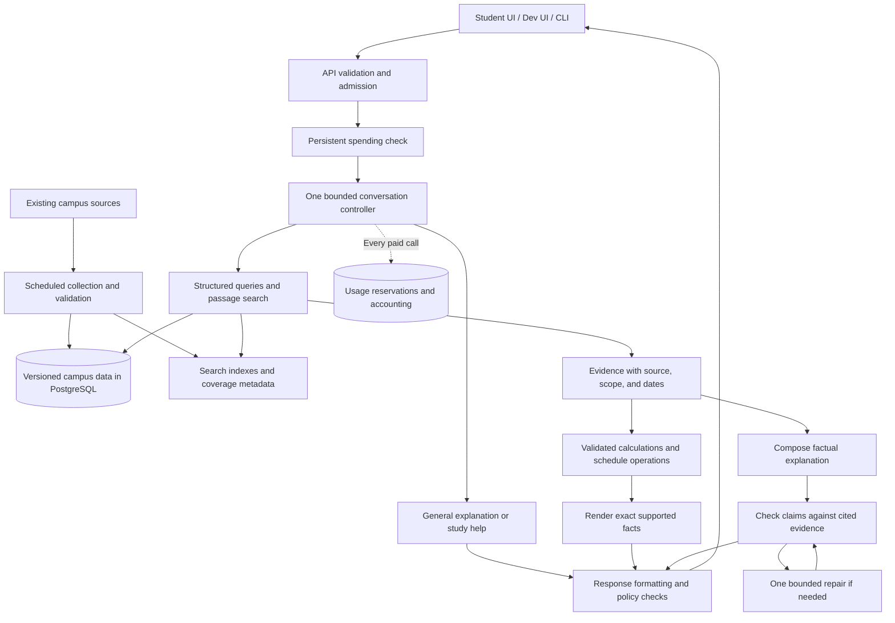

# RockyGPT Brain: architecture and implementation plan

## 1. Decision and intended outcome

**Preserve the working foundation and redesign the answering engine inside it. A complete rebuild of the project is not justified by the evidence.**

FastAPI, PostgreSQL, separate data ingestion, stateless conversations, source citations, and the existing regression tests are useful foundations. The current weaknesses are concentrated in how the Brain retrieves information, interprets it, verifies answers, and spends model tokens.

The new design should make the model responsible for understanding language and explaining information. Code should handle exact filtering, calculations, source identity, dates, and spending limits.

### Confirmed constraints

| Area | Decision |
|---|---|
| Audience | Ramapo College students |
| Initial traffic | Approximately 100 questions per day |
| Monthly AI budget | **$10 total**, including evaluation and embeddings |
| Budget exhaustion | Stop paid calls; retain access to available information and official links |
| Campus information | Use the **existing campus sources only** |
| General questions | Support study help and stable general knowledge |
| Live web browsing | Disabled |
| Current work | Planning only; no code changes or paid model experiments |

**Correctness needs a precise definition.** The target is to answer every supported part correctly, handle complex combinations, and clearly identify information that cannot be established. Missing campus information cannot be recovered by changing models when adding sources and live browsing are excluded.

General answers also cannot have a universal correctness guarantee. Rocky should answer stable questions, use calculation tools where appropriate, and avoid presenting unverified current information as fact.

### Why this architecture is the best fit

| Approach | Assessment |
|---|---|
| Continue adding instructions to the current draft/review loop | Does not address repeated searches, weak structured filtering, expensive repair cycles, or missing budget enforcement. |
| Put the campus corpus into a large prompt | Repeatedly sends unnecessary information and makes precise dates, exceptions, and source selection harder to control. |
| Use vector search for every question | Useful for finding passages, but insufficient for exact schedules, dates, dietary filters, and calculations. |
| Build a large network of specialist agents | Adds calls, coordination, and maintenance costs that do not fit this pilot. |
| **One bounded controller with structured retrieval, semantic search, and focused verification** | **Recommended.** Fits the existing services while moving exact work out of model reasoning. |

The current tests and historical failures should remain regression evidence. Tests that encode the existing implementation—such as requiring an AI review for every general response—will change when the behavior changes.

---

## 2. Architecture and answer flow

These boxes are modules within the existing Brain and Data services. They do not require separate deployed agents or a new orchestration platform.

### A. Request handling and conversation context

Keep the existing `POST /v1/chat` request containing ordered user and assistant messages.

The API will:

- Validate size, roles, and message structure.
- Establish the current Ramapo time in `America/New_York`.
- Check concurrency, abuse limits, and available spending capacity.
- Give the controller the accepted conversation and current request.
- Assign a request ID that connects retrieval, model calls, cost, and the result.

Preserve corrections and follow-ups. Earlier assistant statements are context, never authoritative campus evidence.

Do not silently remove conversation turns to save money. If a conversation cannot fit the configured input and spending bounds, return a clear request to shorten or restart it. Automatic conversation summarization is deferred until it can be tested independently.

### B. One controller that preserves all parts of the question

Avoid a preliminary classifier that reduces a request to one topic such as “dining.”

The controller’s first model call should identify the requested tasks, relevant entities, dates, and dependencies while choosing its next action. A request can contain campus facts, calculations, and general help together.

For example:

> “Can I get dinner before the shuttle leaves, and what vegan options are available?”

The internal task list should preserve:

1. The dining venue and date.
2. The relevant meal service.
3. Vegan menu items for that meal and date.
4. The shuttle route, direction, and departure.
5. Any missing duration or travel information needed to assess feasibility.

This is an operational task list, not a stored chain of thought.

Each task must finish as **answered, missing evidence, needing clarification, or failed**. The final answer must account for every task. A missing shuttle detail should not erase a supported menu answer.

### C. Improve the existing data representation

Keep the source catalog unchanged. Improve how its information is published and retrieved.

**Entity identity**

Publish stable entity identifiers and source-supported aliases for venues, offices, programs, and other recurring entities. Preserve mappings across upstream renames.

The Brain should resolve “Birch,” “Birch Tree Inn,” and a published venue identifier through data, rather than through question-specific branches in Python.

Ambiguous matches should remain ambiguous. An embedding match alone must not establish that two campus entities are the same.

**Structured facts**

Expose typed fields where the existing sources support them:

- Venue, service date, meal, and dietary flags.
- Opening intervals and explicit exceptions.
- Shuttle route, stop order, departure, and campus return.
- Academic term, session, deadline type, and effective date.
- Contact identity and contact details.
- Policy passages with their conditions and exceptions.

Do not invent fields that the source does not establish.

**Freshness and provenance**

Separate:

- When a source was fetched.
- When a fact was actually verified.
- When the dataset was published.
- When the fact applies.

Publishing unchanged information must not make it newly verified. Review existing “static” facts so changeable policies, prices, and dates cannot remain valid indefinitely merely because they are checked into Git.

Historical questions should use evidence applicable to the requested period. An old source is not automatically unusable for a clearly historical question.

**Coverage**

Publish metadata describing which entities, dates, and attributes are represented.

This lets the Brain distinguish:

- No matching record.
- A collection that does not cover the requested information.
- A failed retrieval.
- A complete, authoritative result showing no matching service.

Only the last situation can support a suitably scoped negative claim.

### D. Use different retrieval methods for different jobs

**Structured queries for exact questions**

Extend the current campus search tool with validated filters: entity, date range, meal, dietary flags, term, session, route, and direction.

The model supplies a structured request. Code validates it and performs parameterized SQL.

A vegan lunch query should filter the database for the correct date, venue, meal, and dietary flag. The model should not receive a mixed menu and be expected to filter it correctly in prose.

**Combined keyword and semantic search for passages**

Keep PostgreSQL full-text search and add embeddings for policy passages, descriptions, and entity discovery. Combine keyword and semantic rankings, then return the actual supporting text.

Store vectors in the existing PostgreSQL database using `pgvector`. The extension supports combining vector retrieval with PostgreSQL full-text search; a separate vector database is unnecessary for this design. [pgvector documentation](https://github.com/pgvector/pgvector#hybrid-search)

Use `text-embedding-3-small` initially, with its default dimensions. Its documented price is $0.02 per million input tokens. Embed changed content once, keyed by content hash and embedding-model version. [Embedding model documentation](https://developers.openai.com/api/docs/models/text-embedding-3-small)

Retrieval defaults:

- Apply source, dataset, entity, and date restrictions before selecting evidence.
- Retrieve up to 20 keyword and 20 semantic candidates.
- Merge and return up to eight relevant passages within the evidence-token allowance.
- Preserve headings and nearby qualifying text.
- Use exact vector search initially; introduce an approximate index only if measured database latency requires it.
- Fall back to keyword search if embeddings are unavailable, recording reduced search coverage.

These are configurable retrieval parameters. Relevance scores rank candidates; they are not proof that a claim is true.

### E. Put calculations and schedule reasoning in code

Add a small, allowlisted calculation tool for:

- Comparing times and intervals.
- Finding a next or last scheduled departure.
- Calculating durations.
- Sorting, counting, and filtering complete results.
- Arithmetic with explicit units.
- Testing whether stated time constraints are compatible.

Inputs must reference retrieved values or explicitly supplied user values. Return results with their input references and assumptions.

No generated Python, shell execution, arbitrary SQL, or unrestricted expression evaluation.

For a dinner-and-shuttle plan, code can establish that dinner service begins before a departure. It cannot establish that the student can eat and walk to the stop in time without supported or user-supplied durations. The answer must preserve that distinction.

### F. Replace blanket reviewing with two factual answer paths

**Path 1: exact facts rendered by code**

When the requested answer consists entirely of supported structured values or validated calculations, render it using small reusable formats.

Examples:

- A venue’s dated closing time.
- A contact’s phone number.
- A scheduled departure.
- Menu items satisfying explicit filters.

The output values come directly from validated records. The model cannot substitute a time, phone number, or record ID.

This path is available only when the entity and requested attributes are resolved, coverage is adequate, and there is no unresolved conflict or policy inference. It cannot be selected merely because the model reports high confidence.

**Path 2: generated explanation with focused evidence review**

Policy explanations and complex factual prose still need model generation and review.

Replace the expanding set of scenario-specific review flags with a claim-oriented contract:

- What factual assertion is being made?
- Which record fields or source passages support it?
- What entity, date, scope, and conditions apply?
- Does a calculation support the conclusion?
- Does the assertion require an unstated premise?

Code checks references, exact values, dates, and calculation results. The reviewer checks meaning and whether the cited evidence actually supports the assertion.

Retain explicit safety constraints where needed. “Avoid hardcoding” does not mean removing rules against unsupported allergy-safety guarantees or invented account access.

Allow **one repair**. Review the changed factual content again. If it still fails, return independently renderable supported facts with a clear limitation, or an unavailable result. Never release a rejected draft or splice together unreviewed prose.

### G. General questions

Stable general explanations, writing help, and study assistance should normally use one model call without campus retrieval.

Use the calculation tool for numerical work when applicable. Mixed questions retain separate campus and general tasks.

Because live browsing is disabled:

- Do not claim to have checked current news, prices, laws, or external schedules.
- Explain when current verification is needed.
- Do not attach unrelated campus citations to general claims.
- Do not force campus-only limitations into ordinary explanations.

General-answer accuracy must have its own evaluation set. Campus retrieval scores do not measure tutoring or reasoning quality.

### H. Bounded execution and caching

Initial runtime limits:

| Limit | Default |
|---|---:|
| Model calls per turn | Maximum 5, including review and repair |
| Retrieval rounds | Maximum 2 |
| Retrieval operations | Maximum 8 |
| Independent retrieval concurrency | Up to 4 |
| Total execution deadline | 30 seconds |
| HTTP deadline | 32 seconds |
| Maximum admitted cost per turn | $0.01 |
| Automatic SDK retries | Disabled |

The controller must reserve time and money for required verification before spending on further retrieval. If a final review cannot fit, use a safe deterministic fallback.

Cache retrieved public evidence by dataset version, entity, filters, and resolved dates. Recompute freshness and time-dependent results before rendering. Do not share cached conversation answers between students.

---

## 3. Model choice and the $10 budget

### Recommended starting model

**Use GPT-5.6 Luna as the initial implementation candidate. Compare it against Gemini and DeepSeek before selecting the production configuration.**

Luna has the strongest directly relevant evidence currently available in this project: the earlier comparison recorded 22/27 passing planned turns, although that is insufficient for launch. Its current documented standard pricing also fits this budget better than the Gemini candidates at equal token volume.

This is a provisional recommendation, not a claim that Luna is universally more accurate.

### Current shortlist

Prices below are standard uncached text rates checked September 11, 2026.

| Model | Input / 1M tokens | Output / 1M tokens | Planned role |
|---|---:|---:|---|
| GPT-5.6 Luna | $0.20 | $1.20 | Initial candidate and reference implementation |
| Gemini 3.1 Flash-Lite | $0.25 | $1.50 | Main alternative |
| Gemini 3.5 Flash-Lite | $0.30 | $2.50 | Test whether improved task performance offsets cost |
| DeepSeek Flash, currently V4.1 | $0.15–$0.30 | $0.60–$1.20 | Cost challenger; assess using peak pricing |
| Claude Haiku 4.5 | $1.00 | $5.00 | Exclude from the initial paid comparison because of budget |

Sources: [OpenAI pricing](https://developers.openai.com/api/docs/pricing), [Gemini pricing](https://ai.google.dev/gemini-api/docs/pricing), [DeepSeek pricing](https://api-docs.deepseek.com/quick_start/pricing/), [Claude pricing](https://platform.claude.com/docs/en/about-claude/pricing).

DeepSeek’s current model name is `deepseek-flash`; older Flash names now resolve to a newer model. Record the actual model identity and configuration used in every evaluation. Do not assume an alias preserves behavior. [DeepSeek model details](https://api-docs.deepseek.com/quick_start/pricing/)

### Provider integration

Create a small provider interface covering:

- Messages and tool results.
- Structured outputs.
- Tool-call identifiers.
- Supported reasoning settings.
- Deadlines and cancellation.
- Input, output, reasoning, and cache usage.
- Normalized errors.

Implement OpenAI and Gemini adapters first. Add DeepSeek for the comparison.

Do not treat changing the base URL as sufficient compatibility. For example, DeepSeek documents different handling of developer messages and ignored parameters; Gemini has provider-specific continuation metadata that its SDK handles. [DeepSeek compatibility](https://api-docs.deepseek.com/guides/responses_api/), [Gemini function calling](https://ai.google.dev/gemini-api/docs/function-calling)

For Luna, begin with `none` reasoning for straightforward extraction/general responses and `low` for complex synthesis and evidence review. Benchmark these settings before promotion; its default is currently `medium`, which should not be inherited accidentally. [Luna documentation](https://developers.openai.com/api/docs/models/gpt-5.6-luna)

Deploy one primary configuration initially. Enable a second provider only after it passes the same acceptance gates. Missing campus evidence must never trigger an expensive-model fallback.

### Cost target

At 3,000 questions per month, $10 permits an average of approximately **$0.00333 per question**, before allocating evaluation and embedding costs.

For illustration, a Luna turn using **6,000 total input tokens and 800 total output tokens across all its calls** costs approximately **$0.00216**, or **$6.48 for 3,000 turns**.

That is a design target, not a measured forecast. All prompts, repeated history, tool results, structured output, and reasoning tokens must be included. Cache savings are not required for this estimate.

Initial monthly allocations:

| Purpose | Allocation |
|---|---:|
| Student model calls | $7.00 |
| Model comparisons and regression evaluations | $2.00 |
| Embeddings | $0.25 |
| Uncertain charges and accounting margin | $0.75 |
| **Total** | **$10.00** |

Unused allocations must not be transferred automatically. Changing them is an explicit configuration change that preserves the $10 global ceiling.

### Enforce spending before calls happen

Add persistent usage accounting in a separate operational PostgreSQL schema. Keep the campus-data connection read-only.

Every paid caller—including Brain, evaluation traffic, and ingestion embeddings—must:

1. Estimate the serialized input and maximum billed output.
2. Atomically reserve a conservative amount.
3. Make the call only if both its allocation and the global budget permit it.
4. Settle using returned usage.
5. Retain a conservative charge for ambiguous timeouts until reconciled.

Use dedicated project credentials. Calls made elsewhere with shared credentials would be outside this application’s accounting.

Enforce reservations across processes and restarts. If accounting is unavailable, paid calls stop. Do not rely on dashboard alerts as a spending cap.

At exhaustion, return a non-retryable `budget_exhausted` response with the reset date and available official resources. The student interface should remove automatic retries.

The cap concerns API usage; hosting and applicable taxes are outside the stated AI budget.

---

## 4. Implementation sequence, interfaces, and code structure

### Phase 1 — Establish the baseline and spending controls

- Freeze the current source identity, existing tests, and original conversation corpus.
- Preserve the saved failure reports and today’s two live diagnostic responses.
- Add usage reservations and normalized provider accounting before further paid experiments.
- Add latency measurements for retrieval, generation, review, and repair.
- Make evaluation budgets explicit and fail closed when exhausted.

**Exit:** concurrent calls, failures, and restarts cannot bypass the application’s budget rules.

### Phase 2 — Improve retrieval using the same sources

- Publish entity identities, aliases, typed filters, and coverage metadata.
- Correct publication-time versus verification-time handling.
- Add reusable embeddings and combined passage search.
- Add deterministic schedule and arithmetic operations.
- Validate retrieval against captured evidence before involving a model.

**Exit:** the required evidence for answerable test cases is retrievable, with correct dates, entities, and completeness indicators.

### Phase 3 — Replace the answering loop

- Introduce the task-preserving controller.
- Add exact factual rendering.
- Add claim-oriented composition and verification.
- Enforce one repair and the new execution bounds.
- Support mixed campus/general questions and independent partial answers.
- Remove superseded scenario-specific review machinery only after equivalent behavioral tests pass.

**Exit:** the new engine answers the development corpus without relying on question-specific conditions.

### Phase 4 — Compare and select models

Within the $2 evaluation allocation:

1. Screen the four shortlisted models on the same 32 representative turns.
2. Run the best two eligible configurations on the complete acceptance corpus.
3. Repeat the held-out portion with the selected configuration.
4. Count every failed, timed-out, and unrun turn.
5. Compare total billed work and complete-answer quality.

Selection order:

1. Pass all critical correctness and source-attribution gates.
2. Meet answer-completeness and latency targets.
3. Fit the monthly workload budget.
4. Choose the lowest observed total cost among passing candidates.
5. Use lower tail latency as the tiebreaker.

If the allocation runs out, save the incomplete checkpoint and stop. An incomplete comparison cannot establish that a model or architecture is verified.

### Phase 5 — Integrate clients and deployment

Keep the existing public request shape and response fields:

- `answer`, `status`, `citations`
- `model`, `requestId`, `datasetVersion`
- `elapsedMs`, `trace`, `metrics`

Add optional citation references to exact supporting fields/passages and additive metrics for verification and usage. Existing clients should continue to render ordinary answers without depending on new fields.

Add:

- A read-only resource endpoint using the existing source catalog.
- A simple non-AI resource view for budget exhaustion.
- Clear handling for budget limits, context limits, genuine missing evidence, and provider failures.

Do not rebuild unrelated developer dashboards or all unfinished campus panels in this effort.

Prepare a Python Brain deployment image, compatible database grants, and updated health checks. Keep the current version available for rollback.

### Code-quality rules

Organize the Brain into clear modules for API handling, orchestration, retrieval, evidence, providers, and accounting.

- Keep domain transformations and validators as small pure functions where possible.
- Keep SDK response objects inside provider adapters.
- Version schemas, prompts, pricing configuration, and data representations.
- Keep campus facts, aliases, source URLs, and policy metadata in the data/configuration layer.
- Keep query allowlists, time calculations, safety constraints, and validation logic in code.
- Never add conditions such as “if the question contains this phrase, return this answer.”
- Avoid generated SQL, executable model output, and a general-purpose workflow framework.
- Use additive migrations and independent repository builds; do not import sibling source trees.

---

## 5. Verification and release criteria

### Acceptance corpus

Create **200 scored turns**, incorporating the existing regression conversations:

| Category | Turns |
|---|---:|
| Exact campus facts and filters | 50 |
| Complex questions and plans | 40 |
| Follow-ups, corrections, and topic changes | 35 |
| Policy and passage interpretation | 25 |
| General explanations and calculations | 25 |
| Missing data, conflicts, injection, and safety | 25 |

Reserve 80 turns as a held-out set. Do not tune prompts against those answers.

Use captured source snapshots for reproducibility and a separate current-dataset smoke check. Fixtures may contain expected facts; production code must not contain fixture-specific answers.

Important scenarios include:

- Correct meal, date, venue, and dietary filtering.
- A missing menu distinguished from a closed venue.
- A shuttle’s intermediate stop distinguished from campus departure.
- Overnight schedules, daylight-saving changes, holidays, and dated exceptions.
- Similar entity names and ambiguous references.
- Academic deadlines for the correct term and session.
- An event venue that does not establish a facility’s general location.
- A listed price that does not establish every applicable waiver policy.
- A multi-part question with one unsupported component.
- User corrections preserved over several turns.
- Prompt injection in a user message or retrieved passage.
- Numerical study questions with checkable calculations.
- General questions requiring current information when browsing is unavailable.
- Budget exhaustion, duplicate requests, provider failure, and database failure.

### Required gates

| Measure | Release requirement |
|---|---|
| Material unsupported campus claims | **Zero observed** in acceptance and held-out repetition |
| Citation attribution | Every factual citation points to supporting evidence; wrong record attribution fails |
| Answerable-task completion | At least 98% across the acceptance set |
| Complex-task completion | At least 95%, with every requested part accounted for |
| Required-evidence retrieval | At least 99% on the labeled retrieval set |
| Simple-answer latency | Target p95 below 8 seconds on a warm service |
| Complex-answer latency | Target p95 below 25 seconds on a warm service |
| Cost | Measured traffic mix fits the $7 student allocation and $10 total |
| Spending enforcement | All concurrency, timeout, retry, and restart tests pass |

A refusal or unavailable answer passes only when the test establishes that the information is unavailable or the request cannot appropriately be answered. Refusing an answerable question counts as a failure.

Zero observed errors is a release criterion, not proof that future answers cannot be wrong.

Review factual meaning against source evidence independently of the production verifier. Require manual review of disputed cases and the critical deadline, policy, contact, and safety cases. A model approving its own output is insufficient acceptance evidence.

### Verify that the redesign earns its complexity

Compare the new system with the recorded baseline and run targeted comparisons on the same fixtures:

- Keyword retrieval versus combined keyword/semantic retrieval.
- Exact rendering versus generated wording for structured facts.
- Focused claim verification versus the current blanket review.
- Different supported reasoning settings.
- Complete cost, including failures and repairs.

Retain added components only when they improve measured coverage, correctness, latency, or cost.

### Rollout and maintenance

1. Deploy behind a server-side configuration switch.
2. Run the held-out suite before exposing student traffic.
3. Begin with a small pilot; avoid paid shadow calls that duplicate every request.
4. Monitor errors, missing-answer categories, latency, repair frequency, and spending.
5. Roll back on a critical unsupported claim or a budget-enforcement failure.
6. Re-evaluate model changes, prompt changes, and provider alias changes before promotion.

Store operational metrics without saving student conversation text by default. Keep detailed synthetic evaluation traces separately.

The completed result should be a campus assistant that retrieves the right evidence, performs exact work reliably, explains complex results clearly, acknowledges real gaps, and operates within an enforced budget.
