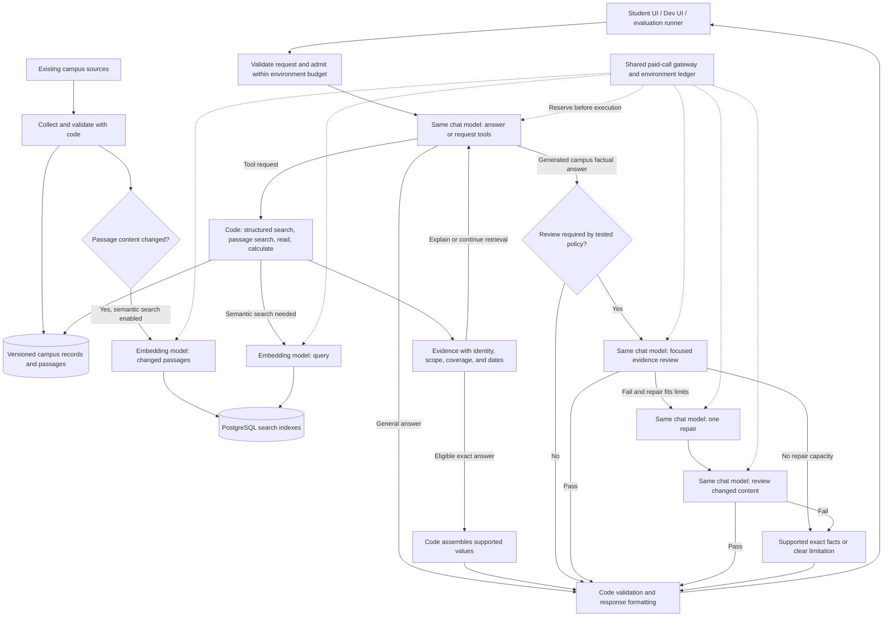

# RockyGPT Brain: simplest effective architecture and implementation plan

Updated September 11, 2026. This document replaces `plain.md` and incorporates the agreed architecture, model parity, traffic, and budget requirements. It is a plan, not a record of implemented changes or authorization to run paid experiments.

## 1. Decisions and success conditions

**Keep the working FastAPI and PostgreSQL foundation. Simplify the answering engine around one tool-using chat controller, one embedding component for semantic search, and evidence checks whose value is measured.** A complete project rebuild is not justified by the current evidence.

Seven previously listed AI responsibilities do not require seven services, models, or calls per question. Understanding, tool selection, and answer writing belong to the same controller. Document and query embeddings belong to the same search component. Review and repair are bounded additional calls. AI evaluation is optional development work outside the student response path.

The goal is the least expensive complete system that reliably answers supported Ramapo questions, including complex questions and follow-ups, and handles general help accurately. Fewer calls are useful only if answer quality remains acceptable.

### Confirmed constraints

| Area | Decision |
|---|---|
| Audience | Ramapo College students |
| Production traffic | Approximately 100 questions/day, or 3,000 turns in a 30-day month |
| Development/testing traffic | Desired volume of approximately 1,000 fresh questions/day, or 30,000 turns in a 30-day month |
| Production AI budget | **$10 per calendar month**, including production model calls and attributable embedding work |
| Development AI budget | **Separate $10 per calendar month**, including experiments, fresh answers, graders, and attributable embedding work |
| Combined allowance | **$20/month; no automatic transfer between environments** |
| Model parity | Same selected chat model, embedding model, and released Brain configuration in both environments |
| Budget exhaustion | Stop paid work in the affected environment; provide supported resources where available |
| Campus information | Existing campus sources only |
| General questions | Stable general knowledge, writing, study assistance, and supported calculations |
| Live web browsing | Disabled in the bot |
| Current scope | Update this plan only; no application changes, deployments, or paid tests |

The development volume is a real target, not permission to exceed $10. Replaying stored answers or running retrieval checks must not be reported as generating 1,000 fresh Brain answers. Under the illustrative costs in section 8, the fresh-answer target is **not yet demonstrated to fit**.

Correctness means answering every supported part, preserving conditions and exceptions, citing the actual supporting evidence, and identifying genuine gaps. Neither a different model nor an extra reviewer can recover facts absent from the permitted sources. Zero observed errors in a test set cannot guarantee that every future answer will be correct.

## 2. What stays, what changes, and what is deferred

Keep these current foundations:

- FastAPI, the stateless conversation contract, and explicit request limits.
- The published, versioned campus dataset in PostgreSQL.
- Separate ownership of ingestion, Brain, clients, evaluations, and deployment.
- Source identity, citations, safe tool execution, and behavioral regression tests.
- The current branch's implementation and documentation as the baseline. Do not recover or reuse old branches or commits for this work.

Change the expensive or error-prone parts:

- Improve structured filtering and evidence selection before adding more model instructions.
- Use one small controller to choose tools, preserve the question's parts, and answer.
- Render exact supported values with code when the request can be fully satisfied that way.
- Stop requiring an AI evidence review for ordinary general conversation or eligible deterministic responses.
- Keep review for generated campus factual prose initially; narrow it only where independent tests support doing so.
- Enforce separate environment budgets before every paid operation.

Defer a specialist-agent network, a separate vector database, a dedicated AI router, an AI reranker, automatic conversation summarization, fine-tuning, and a general workflow framework. Add a component only when a specific measured failure requires it. This follows the principle of starting with simple workflows and adding complexity when it demonstrably helps. [Anthropic's architecture guidance](https://www.anthropic.com/engineering/building-effective-agents)

## 3. Architecture and exact AI call locations

These boxes describe functions in the existing services, not separate deployed agents. The optional development grader also uses the paid-call gateway; it is not part of the diagram's student response path.

### The two AI components

| Component | Responsibilities | When it runs |
|---|---|---|
| **Chat model and controller** | Understand the request; choose tools; answer; perform required evidence review and at most one repair | One or more bounded calls during a conversation turn |
| **Embedding component** | Embed changed passages and semantic search queries | During indexing or a semantic retrieval operation |

One component can make multiple calls. Grouping responsibilities does not itself reduce billing. Count actual input, output, reasoning, embedding, and grading usage.

### Planned chat-call paths

| Answer type | Expected path | Target chat calls |
|---|---|---:|
| Ordinary general question | Understand and answer in the same call | 1 |
| General question needing calculation | Request calculation, execute in code, explain result | Usually 2 |
| Exact campus fact | Request data, then render eligible fields with code | 1; 2 if a second lookup is needed before rendering |
| Campus explanation | Request evidence, write answer, review factual claims | Usually 3 initially |
| Campus explanation with review exemption proven by tests | Request evidence, write answer, run code checks | Usually 2 |
| Complex campus question | Additional retrieval/planning and required review, within the total cap | Target 3–5 |
| Failed factual draft | Repair and recheck only when both calls fit the remaining allowance | Included in the same total cap |

An ambiguity can produce a clarification instead of a factual answer. Query embeddings are additional when semantic search is used. Targets are not measured latency or cost claims.

## 4. The conversation controller

### Request and context handling

Keep `POST /v1/chat` with ordered user and assistant messages. Validate roles, sizes, and schema before any paid work. Resolve the current campus date and time in `America/New_York` and assign a request ID.

Use conversation history to interpret follow-ups and corrections. Previous assistant prose is context, never authoritative campus evidence. Retrieve applicable campus facts again as needed.

Do not silently drop conversation turns or add a paid summarizer. If accepted history cannot fit the input and spending bounds, return a clear context-limit response. Later summarization would need its own evidence of benefit and regression coverage.

### Answer or request a tool in one call

Give the selected chat model a compact tool contract. Its first call can answer a general question, request one or more independent lookups, or ask for clarification. There is no preliminary paid topic classifier and no separate planning essay.

Preserve mixed and multi-part requests. For example, a dinner-and-shuttle question may require a date, venue, meal, dietary filter, route, departure, and an explicitly stated travel duration. Record only operational fields and completion statuses, not private reasoning transcripts.

Each requested part ends as answered, requiring clarification, missing evidence, or failed. A missing shuttle detail must not erase a supported menu answer. Compare the final response to the outstanding parts before returning it.

Request independent evidence together when possible. If a second lookup depends on the first result, allow another controller step within the budget. Do not force all complex questions into one call or retrieve the entire campus corpus into the prompt.

### Small, typed tools

Extend the existing search/read tool surface rather than introducing a tool for every question pattern:

- `search_campus`: validated structured filters or passage search, returning source and coverage metadata.
- `read_campus`: bounded reading of selected records or passages by stable IDs.
- A calculation operation, added where useful, for approved arithmetic and schedule comparisons.

The model supplies structured arguments. Code validates them, selects allowlisted operations, and executes parameterized SQL. Model output cannot execute arbitrary SQL, Python, or shell commands.

## 5. Evidence and retrieval

### Improve the representation of existing sources

Publish stable entity identifiers and source-supported aliases for venues, offices, programs, routes, and other recurring entities. Keep aliases in data; avoid question-specific branches in Brain code. Semantic similarity can suggest candidates but cannot prove that two entities are identical.

Expose typed fields when the source supports them: service date, meal, dietary flags, opening intervals, dated exceptions, term, session, route, direction, stop order, and contact attributes. Do not invent missing fields or translate an unknown attribute into a negative value.

Maintain distinct timestamps for source fetch, fact verification, publication, and applicability. Republishing unchanged data must not renew its verification time. Review source-specific freshness rules; a changeable policy or deadline should not become permanently reliable merely because it is classified as static.

Publish coverage metadata for represented entities, dates, and attributes. Distinguish an empty result, uncovered information, a retrieval failure, and a complete authoritative result establishing no matching service. Only the last supports an appropriately scoped negative claim.

Historical evidence can answer historical questions when its applicability matches. Preserve headings, exceptions, document versions, and surrounding qualifications in policy passages.

### Structured retrieval first for exact facts

Use typed, parameterized filters for dates, venues, meals, dietary flags, terms, sessions, routes, and directions. A vegan lunch question should retrieve the correct filtered records rather than ask the model to sort a mixed menu in prose.

Return bounded records with exact field values, evidence IDs, source URLs, applicability, freshness, and coverage. Conflicting records remain visible as conflicts; the model must not silently choose a convenient answer.

### Semantic search where it improves recall

Keep PostgreSQL full-text search. Add embeddings for relevant passages if the retrieval benchmark shows meaningful gains on paraphrases and policy questions. Use `pgvector` in the existing database rather than a separate vector service. [pgvector hybrid-search guidance](https://github.com/pgvector/pgvector#hybrid-search)

`text-embedding-3-small` is the initial embedding candidate, with the same model and dimensions in both environments. Its documented input price is $0.02 per million tokens. Reconfirm pricing before implementation. [Embedding model documentation](https://developers.openai.com/api/docs/models/text-embedding-3-small)

Embed changed passages once, keyed by content hash, chunking version, embedding model, and dimensions. Query embeddings are needed only for semantic retrieval and can be reused for identical normalized queries under the same embedding configuration.

Start with bounded keyword and semantic candidate sets, merge them with a simple rank-based method in code, and return a small evidence set. Initial configurable limits can be 20 candidates per search method and eight final passages, subject to a stricter total token allowance. Preserve relevant qualifiers when trimming.

Use exact vector search first; add an approximate index only if measured database latency warrants it. An embedding failure may fall back to keyword search, with reduced coverage recorded. It must not turn incomplete retrieval into a definitive negative answer.

No separate AI query-expansion service or AI reranker is included. The controller's tool request already provides the search wording.

### Calculations and schedules

Perform time comparisons, next/last departures, durations, counts, sorting, and arithmetic with explicit units in code. Every input must come from retrieved evidence or an explicit user value. Return input references and any assumptions with the result.

For dinner before a shuttle, code can compare service hours and departure times. It cannot invent eating or walking duration. Preserve overnight intervals, daylight-saving transitions, holidays, term/session boundaries, and explicit exceptions.

## 6. Answer construction, checking, and limits

### Exact responses assembled by code

When the request is fully satisfied by validated fields or calculation results, use small reusable formats to produce the answer and citations. Eligible examples include a dated closing time, an office phone number, a scheduled departure, or a filtered menu list.

Require resolved entities, requested attributes, adequate coverage, applicable dates, and no unresolved conflict or policy inference. The selected fields must answer the user's actual request; accurate values for the wrong venue or meal still fail. Model confidence alone never enables this path.

These formats describe reusable data shapes, not hardcoded campus answers. Values, aliases, URLs, and applicable dates come from published data.

### Generated factual explanations

Give the chat model the relevant evidence and ask for an answer with claim-to-evidence references and necessary conditions. Keep the representation compact. Code validates cited IDs, exact fields, dates, calculation references, and permitted URLs.

Initially, require an independent-context review call using the same selected chat model for generated campus factual prose. Give the reviewer the draft claims and their relevant evidence, not the writer's private reasoning or unsupported prior assistant text.

The reviewer checks whether the evidence supports the meaning, scope, conditions, exceptions, and conclusions. Code cannot generally prove that a policy interpretation is faithful. A self-check instruction inside the writing call is not equivalent to this separate review, and a separate review is still fallible.

Remove the review only from answer categories for which held-out evaluation supports the exemption. Start with deterministic exact responses and ordinary general answers. Any further exemption must be based on observable answer/evidence structure and independent results, not a phrase list or the model's confidence score. Keep complex policy interpretation, conflicting evidence, and cross-source inference under review unless their own evidence justifies a change.

Allow one repair after an actual failure. Review the changed factual content again. If it still fails or the necessary calls do not fit, return independently renderable supported facts and a limitation, or an unavailable response. Never release rejected prose or quietly skip a required check to finish within budget.

### General and mixed questions

Ordinary stable general explanations, writing help, and study assistance should usually finish in one call. Use the approved calculation tool when necessary. Mixed answers retain the supported campus portions, general portions, and unresolved portions without attaching unrelated campus citations to general claims.

With bot browsing disabled, do not claim to have verified current external news, prices, laws, or schedules. Explain the limitation when current information matters. Evaluate general knowledge and reasoning separately from campus retrieval.

### Shared execution bounds

| Limit | Initial proposed default |
|---|---:|
| Chat calls per turn | Maximum 5, including planning, writing, review, repair, and recheck |
| Retrieval rounds | Maximum 2 |
| Retrieval operations | Maximum 8 |
| Independent retrieval concurrency | Up to 4 |
| Query-embedding calls | Maximum 2 per turn, only for needed semantic queries |
| Real-time execution deadline | 30 seconds |
| HTTP deadline | 32 seconds |
| Admitted maximum cost per turn | $0.01, additionally constrained by the environment's remaining budget |
| Automatic SDK retries | Disabled |

These are safety ceilings, not typical usage targets. A $0.01 ceiling does not imply that either environment can afford that average.

Reserve calls, time, and money for required verification before further retrieval. A repair that requires rechecking needs two remaining chat slots. After a complex retrieval sequence, it may be necessary to return supported partial information rather than attempt repair. Never allow the five-call cap to expand implicitly.

Do not add AI calls solely to label uncertainty or format errors. Use explicit code statuses for missing evidence, limits, failures, and budget exhaustion.

### Cache the reusable work

Cache public evidence by dataset version, entity, filters, and resolved dates. Recheck freshness and time-dependent applicability before use. Preserve invalidation on source and schema changes.

Reuse unchanged document embeddings and suitable frozen public-data indexes in development. Provider prompt caching may reduce repeated-prefix cost where supported, but measure actual billed cache usage. Do not assume batch and cache discounts stack.

Do not share personalized conversation answers between students. During answer-quality evaluation, bypass any full-answer cache and record whether the model was actually called.

## 7. Model choice and development/production parity

### One selected configuration in both environments

Development must test the model that production will use. Keep the same selected model identity, supported reasoning settings by role, prompt versions, tool schemas, retrieval settings, rendering eligibility, review policy, and execution bounds in the released configuration.

The embedding model, dimensions, and chunking configuration must also match. Development can use a frozen source snapshot for reproducibility; record its identity and run separate smoke checks against the current published dataset.

Proposed changes are tested in development. Promote the exact tested configuration to production as a versioned release. Do not use a weaker development model, a development-only relaxed verifier, or a different reasoning profile to make the bill look smaller.

Use a pinned model snapshot where the provider offers one. Otherwise record the requested alias, returned model identity, provider, configuration hash, and test date; treat observed provider changes as reasons to re-evaluate. Do not assume aliases are immutable.

### Initial model comparison

The current documented Brain default is GPT-5.4; editing this plan does not change it. **GPT-5.6 Luna remains the provisional comparison baseline. Mistral Small 4 is the first cost challenger.** Neither is declared the final production choice by this document.

The next comparison should first establish whether Mistral can match the necessary grounded-answer quality at lower total cost. Gemini 3.1 Flash-Lite, DeepSeek Flash, and GPT-OSS 120B through Groq remain later candidates if the first pair cannot satisfy the accuracy/cost requirements. Do not pay to run every alternative on 1,000 daily questions.

Use the cheapest configuration that passes the independent quality gates and fits the measured workload. Sticker price alone does not account for extra tool rounds, reasoning, incomplete answers, or repairs. A model that cheaply refuses answerable questions does not pass.

### Keep provider integration small

Keep SDK objects inside a thin adapter covering messages, tool calls/results, structured responses, reasoning options, deadlines, normalized usage, and errors. Begin with the existing provider and the one challenger actually being evaluated. Add other adapters only when the comparison requires them.

Provider compatibility must be tested; changing a base URL is not sufficient. Preserve tool-call IDs, structured-output behavior, continuation metadata, and provider-specific handling of reasoning tokens and limits. [Gemini function-calling documentation](https://ai.google.dev/gemini-api/docs/function-calling), [DeepSeek Responses compatibility](https://api-docs.deepseek.com/guides/responses_api/)

Set reasoning explicitly where supported. For Luna, evaluate `none` for straightforward work and `low` for synthesis/review as initial profiles; these are hypotheses, not accepted quality settings. Apply the winning profiles identically in development and production. [Luna model documentation](https://developers.openai.com/api/docs/models/gpt-5.6-luna)

Deploy one primary model initially. Missing source evidence never triggers a more expensive model, and budget exhaustion never triggers a free-provider fallback. A provider change needs its own evaluation before deployment.

## 8. Two independent budgets and what the traffic costs

### Price reference and illustrative costs

Rates below were checked against official documentation on September 11, 2026. They are standard uncached text rates; recheck before paid implementation work.

The estimates assume **6,000 total input tokens and 800 total billable output tokens per completed question across every chat call**, including reasoning where billed. That allowance is an illustration, not a measurement of the current or proposed Brain. Actual evidence size, history, repairs, and model behavior can change it substantially.

| Candidate | Input / output per 1M tokens | Production: 3,000 questions | Development: 30,000 questions | Development if all eligible generation uses batch |
|---|---:|---:|---:|---:|
| Mistral Small 4 | $0.15 / $0.60 | $4.14 | $41.40 | $20.70 |
| GPT-5.6 Luna | $0.20 / $1.20 | $6.48 | $64.80 | $32.40 |
| Gemini 3.1 Flash-Lite | $0.25 / $1.50 | $8.10 | $81.00 | $40.50 |
| DeepSeek Flash, currently V4.1 | $0.15–$0.30 / $0.60–$1.20 | $4.14–$8.28 | $41.40–$82.80 | No batch discount assumed |
| GPT-OSS 120B through Groq | $0.15 / $0.60 | $4.14 | $41.40 | $20.70 |

Standard sources: [Mistral pricing](https://docs.mistral.ai/inference/pricing), [OpenAI pricing](https://developers.openai.com/api/docs/pricing), [Gemini pricing](https://ai.google.dev/gemini-api/docs/pricing), [DeepSeek pricing](https://api-docs.deepseek.com/quick_start/pricing/), [Groq model pricing](https://console.groq.com/docs/models).

Batch sources: [Mistral batch processing](https://docs.mistral.ai/studio/batch-processing), [OpenAI pricing](https://developers.openai.com/api/docs/pricing), [Gemini pricing](https://ai.google.dev/gemini-api/docs/pricing), [Groq batch processing](https://console.groq.com/docs/batch). Groq documents that its batch discount does not stack with prompt caching. DeepSeek's range reflects peak/off-peak pricing; plan conservatively using peak pricing until the measured traffic schedule supports another estimate.

The table excludes embeddings, separate AI graders, failed attempts beyond the assumed token totals, source infrastructure, and taxes. It also assumes one tested candidate per question. Comparing two models on every question approximately adds their separate costs.

### Explicit feasibility targets

| Environment | Monthly AI cap | Average available at the requested 30-day volume |
|---|---:|---:|
| Production | $10 | Approximately $0.00333 per completed turn |
| Development/testing | $10 | Approximately $0.000333 per fresh completed test turn |

Other AI work comes from the same environment allowance, so the actual chat-call target must be lower. A 31-day month or additional usage also changes the available average.

Production appears plausible under the example, subject to measurement. **Development's 1,000 fresh answers/day does not fit the example, even at the listed batch prices.** Reducing the number of diagram boxes does not resolve that constraint.

Test whether compact tool schemas, selective evidence, deterministic responses, fewer unnecessary calls, measured prefix caching, and batch execution reduce actual cost sufficiently. Never count weaker reasoning, skipped required verification, incomplete answers, or cached-answer replay as equivalent savings.

If the measured complete workload still exceeds $10, report that the full operating target is unmet. A larger development allowance or fewer fresh runs would require a user decision. Preserve the chosen model and quality settings while the decision is pending; do not silently transfer production funds or lower development quality.

### Enforce spending before calls

Use separate provider projects/credentials for production and development, plus separate ledger namespaces and grants. Environment identity comes from trusted server/job configuration, never a client-supplied field. Development cannot read production credentials or spend its balance.

Add persistent accounting in a separate operational PostgreSQL schema. Keep the campus retrieval role read-only. One small paid-call gateway applies to Brain calls, query/document embeddings, model comparisons, graders, and batch jobs.

For each paid operation:

1. Determine its environment and applicable calendar-month budget in `America/New_York`.
2. Estimate a conservative provider-aware upper cost from serialized inputs, supported maximum output, reasoning, cache behavior, and current price configuration.
3. Atomically reserve that amount only if settled charges plus outstanding reservations stay within the environment's $10 cap and the operation's limits.
4. Execute with explicit limits and an idempotent local operation identity.
5. Settle from returned provider usage and release only the proven unused reservation.
6. Retain the conservative reservation for ambiguous timeouts/cancellations until usage is reconciled. Unknown usage is not zero usage.

Admission must work across concurrency, processes, and restarts. If the ledger or a usable price configuration is unavailable, paid calls stop. Budget reset must not erase unsettled commitments or permit queued work to evade accounting at a month boundary. Attribute delayed charges consistently with the provider's billing rules and reconcile them.

Reserve queued batch work before submission, not when results arrive. A cancelled or expired job can still have billable completed requests. Never resubmit an uncertain batch as though the first attempt were free.

Use provider usage reconciliation to identify differences and unexpected external spending. Dedicated credentials are necessary because unrelated scripts using shared keys can bypass application accounting. Dashboard alerts alone do not implement a hard cap.

Track usage categories within each environment for diagnosis. Production has its own $10; development has its own $10. The caps cover AI API usage; hosting and applicable taxes remain outside the stated allowance.

At exhaustion, stop new paid calls in that environment. Return a stable, non-retryable `budget_exhausted` result with the reset date and available official resources. Use the existing source catalog and non-AI rendering for that response; do not start an LLM to explain the limit. A failed development budget must not interrupt production.

## 9. Development and evaluation without misleading savings

### Count three kinds of work separately

| Work | What it establishes | How it is counted |
|---|---|---|
| Fresh complete Brain run | Current model behavior with actual tools and required checks | One completed test turn; record every internal call and charge |
| Retrieval, rendering, contract, and calculation checks | Correctness of code and evidence selection | Local/component checks; zero chat-model calls, though uncached semantic queries can incur embedding usage |
| Replay of saved outputs | Regression behavior of downstream code | Replay checks; never counted as fresh model answers |

Count failures, timeouts, unavailable answers to answerable questions, and budget-skipped turns explicitly. Report requested, admitted, completed, and passed counts. A conversation with five user turns is five test turns; an AI grader is additional paid work.

### Grade cheaply where the facts are checkable

Create source-grounded expected facts, acceptable answer conditions, citation IDs, and calculation results. Use code for exact values and structured checks. Do not rely solely on string matching for paraphrased explanations or policy interpretation.

Use human review for critical or disputed factual meaning. Optional AI grading uses the selected chat model and can help screen explanations, but must be metered, sampled, and calibrated against human judgments. It is not automatically run for every test and does not certify its own model's accuracy. Its separate grading prompt does not alter the Brain configuration being tested.

No recurring AI question generator is included. Maintain a curated corpus and add paraphrases, failures, and new source cases deliberately. Any future paid question generation belongs to the development budget.

### Use batch for quality tests, real-time calls for runtime behavior

Batch is an optional transport optimization for fresh offline tests. Reuse the same controller, prompts, model settings, tool execution, evidence checks, and per-turn call ceilings. Avoid a second, simpler implementation that bypasses production behavior.

Process independent pending model calls together. Resume each test with its own actual result, execute requested tools through the real code, and submit the next dependent round when needed. Do not prefill ideal tool choices or ideal intermediate answers that the tested model did not produce.

Use a fixed dataset and logical campus time for reproducibility. Batch jobs need an explicit offline wall-clock policy because results are delayed; they cannot run under the live HTTP deadline. Label that difference. Batch results measure quality and cost, not interactive latency, live concurrency, or timeout behavior.

Keep a representative real-time subset using the exact production deadlines and request path. Include its cost in the $10 development cap. Mixed batch/real-time spending will be higher than the all-batch column in section 8.

Implement this runner only after cost profiling shows the batching benefit justifies it. Start with a small controlled real-time sample rather than building a complex batch scheduler before the Brain works.

## 10. Implementation sequence and ownership

### Phase 1 — Baseline, configuration, and accounting

- Capture the current branch's code/configuration identity, public contract, representative dataset, and existing regression corpus.
- Add a versioned configuration shared by both environments, with environment-owned credentials and budgets supplied separately.
- Add the paid-call gateway, reservation ledger, and usage/error normalization before paid experiments.
- Measure model calls, tokens by category, retrieval time, writing/review/repair time, and total cost per complete turn.
- Test budget isolation, admission races, restart recovery, unknown usage, month boundaries, and batch commitments without paid calls.

**Exit:** no paid caller can bypass its environment's accounting, and instrumentation can explain each charge. No model is selected by an unmeasured cost estimate.

### Phase 2 — Make the right evidence retrievable

- In the Data repository, improve identities, aliases, applicability, coverage, and typed fields from existing sources.
- In Brain, improve parameterized filters, bounded reading, and evidence contracts.
- Add calculation operations and exact rendering for supported data shapes.
- Compare keyword-only retrieval with semantic retrieval on labeled paraphrases and policy cases; add the embedding/index path where it earns its cost and complexity.
- Reuse existing public embeddings in suitable development snapshots instead of rebuilding the index for each run.

**Exit:** required evidence is retrieved for the labeled cases with correct entities, dates, qualifiers, and coverage. Retrieval can be evaluated independently of answer generation.

### Phase 3 — Implement the small controller and answer paths

- Use one model call to answer, request tools, or clarify; preserve multi-part tasks without a preliminary classifier.
- Add deterministic factual responses and a one-call general path.
- Keep generated campus prose under focused review initially.
- Implement one repair with explicit capacity for its recheck and a safe fallback when it cannot fit.
- Enforce all call, time, context, and spend ceilings in one place.
- Preserve adversarial, follow-up, correction, partial-answer, and source-attribution behavior while removing superseded scenario-specific machinery.

**Exit:** the simpler engine passes the development corpus using reusable logic, with every AI operation visible in usage metrics.

### Phase 4 — Compare only what is needed

Use the development $10 allowance for this work and all other development AI usage. It is not an extra evaluation allowance.

1. Begin with a small balanced screen, approximately 32 representative turns per candidate, comparing Luna and Mistral Small 4 on the same snapshot.
2. Project the next run's conservative maximum cost before admitting it; reduce the run scope or stop when the remaining allowance cannot cover it.
3. Evaluate the strongest eligible configurations on the full acceptance corpus and held-out portion as funding permits.
4. Compare the same configuration with and without particular review exemptions on independently assessed answers. Do not remove review merely because the writer or its own reviewer prefers that version.
5. Measure complete-turn cost distributions, including failures, review, repairs, reasoning, and embeddings.
6. Add another provider candidate only if needed to address a demonstrated quality or cost failure.

Select first for critical correctness and completeness, then for measured cost at the target traffic, then latency. Hold model, prompts, retrieval, and test data fixed when isolating the effect of one change.

**Exit:** one configuration is selected on evidence. If funds run out or neither candidate passes, preserve the checkpoint and report an incomplete result. An unfinished comparison does not establish an optimal model.

### Phase 5 — Test volume and simplify further where proven

- Measure a representative real-time sample on the selected configuration.
- Add batch execution for offline quality runs if warranted; verify it preserves the same logical Brain behavior.
- Use measured token distributions and the real batch/real-time mix to forecast both environments, including grading and indexing.
- Remove review only from categories whose held-out results support exemption. Repeat critical cases after each such change.
- Validate the desired 1,000 fresh development turns/day against the remaining allowance before launching a full daily run.

**Exit:** report separately whether accuracy, production cost/traffic, and development cost/traffic targets pass. The overall operating goal remains unmet if the desired development volume still cannot fit $10. Do not conceal that failure by relabeling local checks or lowering the development model.

### Phase 6 — Integrate and release the tested configuration

Keep the existing public request shape and response fields: `answer`, `status`, `citations`, `model`, `requestId`, `datasetVersion`, `elapsedMs`, `trace`, and `metrics`.

Add compatible optional evidence references and operational metrics where useful. Do not expose private reasoning, internal rejection prose, or detailed billing/accounting internals in student answers.

Update clients to handle budget exhaustion, context limits, missing evidence, and provider failure without automatic retry storms. Reuse a simple non-AI resource view; add a small read-only source-catalog endpoint only if the existing client contract cannot supply it. Leave unrelated campus panels and dashboard features outside this work.

Prepare the Brain deployment image, grants, configuration release, and health checks in the appropriate repositories. Keep the prior release available for rollback. A deployment candidate must match the tested model/configuration identity.

**Exit:** clients retain compatibility, the deployment is reviewable, and the exact selected Brain configuration can be released and rolled back. This document does not itself authorize deployment.

### Repository ownership and code quality

| Repository | Planned responsibility |
|---|---|
| `rockygpt-brain` | Controller, tool contracts, evidence validation/rendering, provider boundary, request accounting |
| `rockygpt-data` | Existing-source ingestion, identities, coverage, freshness, changed-passage indexing |
| `rockygpt-evals` | Fixtures, fresh runs, optional batch transport, graders, independent result reports |
| `rockygpt-ui` and `rockygpt-dev` | Compatible chat handling and clear limit/failure states |
| `rockygpt-infra` | Deployment configuration, credentials/grants, operational storage, rollback |

Keep small typed modules for orchestration, retrieval, evidence, providers, and accounting. Prefer pure functions for domain transformations and validators. Do not create a class hierarchy or service boundary solely because this document has a section for a concern.

Version prompts, schemas, price configuration, model settings, and source representations. Keep facts, aliases, source URLs, and source-specific policy metadata in data/configuration. Keep query allowlists, time arithmetic, budget enforcement, and validation in code.

Avoid phrase-specific answers and generated executable code. Explicit safety rules remain appropriate: a missing allergen field is not a safety guarantee, and public evidence does not imply access to a student's private account. Use additive migrations and independent repository builds rather than importing sibling source trees.

## 11. Evaluation and acceptance criteria

### Corpus and evidence

Maintain an initial **200 scored-turn** corpus using current-branch regression cases and source snapshots:

| Category | Turns |
|---|---:|
| Exact campus facts and filters | 50 |
| Complex questions and plans | 40 |
| Follow-ups, corrections, and topic changes | 35 |
| Policy and passage interpretation | 25 |
| General explanations and calculations | 25 |
| Missing data, conflicts, injection, and safety | 25 |

Reserve 80 turns as held-out evidence. Split by conversation/scenario family so near-duplicate follow-ups do not leak between tuning and held-out sets. When a held-out failure is used for tuning, replace it with new held-out coverage before claiming an independent result.

Keep dated expected facts tied to source snapshots and supplement them with current-dataset smoke checks. Fixture-specific answers are allowed in tests, never in production logic.

Cover meal/date/venue/dietary filtering; missing menu versus closed venue; route direction and intermediate stops; overnight schedules and daylight saving; holidays; term/session deadlines; ambiguous entity names; policy conditions and waivers; incomplete multi-part questions; corrections; source and user prompt injection; allergy claims; general calculations; unavailable current external facts; and budget/provider/database failures.

### Release and operating gates

| Measure | Requirement |
|---|---|
| Material unsupported campus claims | Zero observed in acceptance and held-out repetition |
| Citation attribution | Every factual citation supports its actual claim; wrong-record attribution fails |
| Answerable-task completion | At least 98% across the acceptance set |
| Complex-task completion | At least 95%, accounting for every requested part |
| Required-evidence retrieval | At least 99% on the labeled retrieval set |
| Simple-answer latency | Target p95 below 8 seconds on a warm real-time service |
| Complex-answer latency | Target p95 below 25 seconds on a warm real-time service |
| Production feasibility | Measured production mix supports approximately 100 questions/day within its $10/month AI cap |
| Development feasibility | Measured test mix supports approximately 1,000 fresh complete answers/day within its separate $10/month AI cap; otherwise explicitly unmet |
| Environment parity | Released model, reasoning, prompts, tools, retrieval, and review policy match |
| Spending enforcement | Isolation, concurrency, restart, uncertain usage, queued work, and boundary tests pass |

Report sample sizes, failed/unrun counts, and the uncertainty of cost projections. These are pilot gates, not a claim of universal correctness or statistically established zero risk.

An unavailable answer passes only when the fixture establishes missing evidence or another legitimate limitation. Refusing an answerable question counts as a failure. Assess meaning against original evidence independently of the production verifier, with manual review of disputed and critical deadline, policy, contact, and safety cases.

### Demonstrate that each extra step helps

Compare keyword versus hybrid retrieval; deterministic versus generated exact answers; generated prose with versus without specific review exemptions; supported reasoning profiles; and real-time versus batch quality. Measure complete-answer accuracy, retrieval coverage, refusal rate, citation correctness, tail latency, repair frequency, and total billed work.

Retain an added component or review step when it addresses meaningful failures. Remove it when independent evidence shows it does not justify its cost or delay. Revalidate the resulting whole configuration, rather than assuming isolated improvements combine safely.

## 12. Rollout, maintenance, and completion

Release behind a server-side configuration switch. Run the held-out suite before exposing student traffic, then begin a small pilot. Avoid duplicating every production request as a paid shadow call under this budget.

Monitor supported-answer completion, unsupported claims, missing-data categories, latency, review/repair frequency, actual token usage, and each environment's remaining commitments. Store operational metrics without saving student conversation text by default. Synthetic evaluation traces can contain detailed evidence under separate retention controls.

Roll back on a critical unsupported claim, incompatible provider/model change, or budget-enforcement failure. Re-evaluate model aliases, prompts, tool schemas, source schema changes, retrieval changes, and review exemptions before promotion. A changed model version must not reach production without corresponding development validation.

Completion requires a measured configuration that answers supported campus and general questions well, preserves model parity, and meets the separately reported cost/traffic targets. Until the development target is demonstrated within $10, keep that limitation visible. The plan's priorities are accurate evidence, a small understandable controller, measured use of extra AI calls, and enforceable spending.
