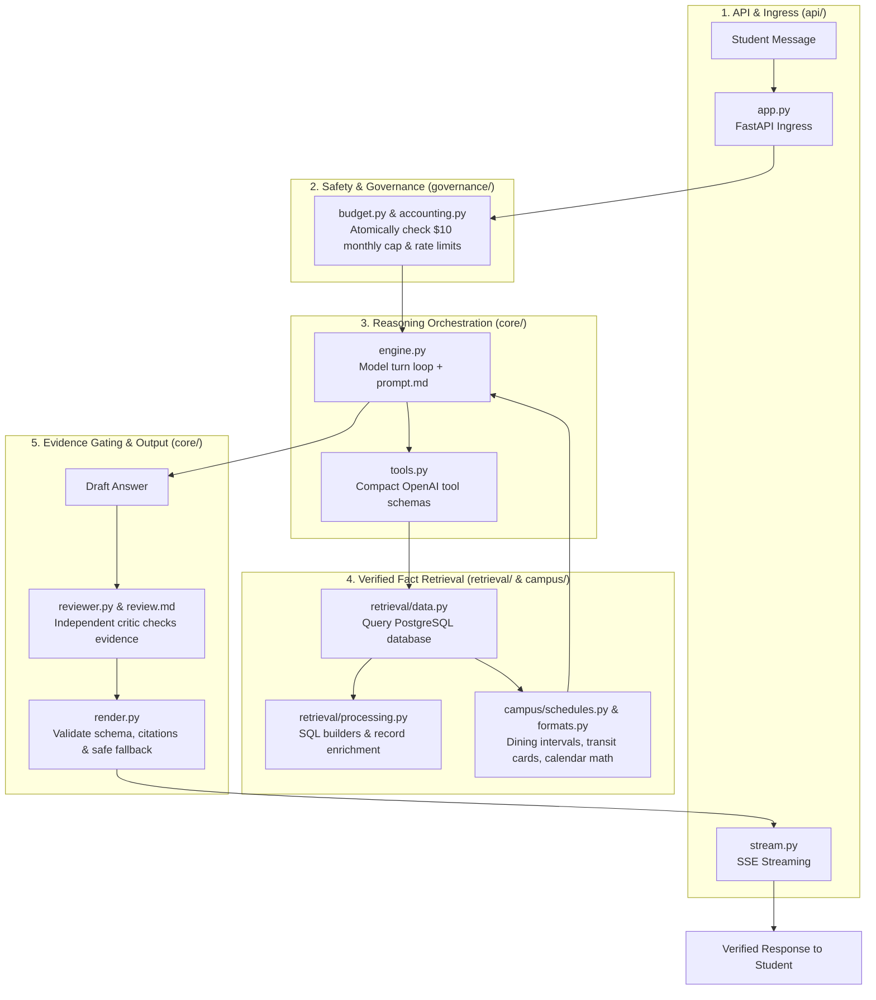

# RockyGPT Brain Architecture Guide

Welcome to the internal source directory of **RockyGPT Brain** (`rockygpt-brain`). This guide provides a visual map of how the codebase is structured so any human engineer can navigate and reason about the system at a glance.

---

## 1. The 10-Second Mental Model

RockyGPT Brain operates as an **evidence-gated, zero-hallucination assistant**. Every student query moves through five clear domain stages:



---

## 2. Directory Layout & Responsibilities

The codebase is organized into **5 domain subpackages** plus top-level configuration:

```text
src/rockygpt_brain/
├── 📁 api/            # INGRESS: FastAPI HTTP endpoints & Server-Sent Events (SSE)
├── 📁 governance/     # GATEKEEPER: Budget caps, token limits, ledger accounting
├── 📁 core/           # REASONING: Conversation controller, LLM execution, critic
├── 📁 retrieval/      # FACTS: PostgreSQL connection, SQL query building, search
├── 📁 campus/         # RULES: Ramapo College dining, transit, calendar math
├── __init__.py        # Public interface & backwards-compatibility aliases
├── config.py          # Environment settings, release hash & model rates
├── contracts.py       # Pydantic request/response schemas
├── prompt.md          # System prompt for model turn orchestration
├── review.md          # Critic prompt for evidence verification
└── release.json       # Version release declaration
```

---

## 3. Subpackage File Reference

### 📁 `core/` — Orchestration & LLM Execution
| File | Responsibility |
| :--- | :--- |
| **`engine.py`** | Main conversational loop (`run_turn`), tool dispatch, and prompt integration |
| **`provider.py`** | OpenAI provider client, structured outputs, and token price calculations |
| **`tools.py`** | Tool definitions (`search_campus`, `read_campus`, `calculate`) |
| **`render.py`** | Answer rendering, schema validation, and fallback handling |
| **`reviewer.py`** | Critic review logic verifying that every factual claim is grounded in evidence |

### 📁 `retrieval/` — Database & Evidence Extraction
| File | Responsibility |
| :--- | :--- |
| **`data.py`** | `CampusData` class: PostgreSQL connection pool, cache, and query dispatch |
| **`models.py`** | Table definitions, collection metadata, and query contracts (`SearchQuery`, `ReadQuery`) |
| **`processing.py`** | Parameterized SQL query builders, artifact decoding, and record enrichment |
| **`helpers.py`** | Tokenization, date bounding, and serialization utilities |
| **`exact.py`** | Fast deterministic campus contact directory lookup |

### 📁 `campus/` — Ramapo College Domain Logic
| File | Responsibility |
| :--- | :--- |
| **`schedules.py`** | Dining hall and building opening/closing interval calculations |
| **`calculations.py`** | Academic calendar date arithmetic and semester deadline math |
| **`formats.py`** | Deterministic exact answer formatting (menus, shuttle timetables, office cards) |
| **`progress.py`** | Real-time progress callback hooks and status events |

### 📁 `governance/` — Budgets, Safety & Ledger
| File | Responsibility |
| :--- | :--- |
| **`accounting.py`** | `PostgresLedger`: Atomic multi-process reservation and settlement ledger |
| **`budget.py`** | `TurnBudget`: Per-turn spending ceilings ($0.01 max) and monthly cap admission control |
| **`limits.py`** | HTTP request body size and token safety middleware |
| **`reconcile.py`** | Manual/operator usage receipt reconciliation for uncertain calls |
| **`evidence.py`** | Claim citation bounding and evidence verification rules |

### 📁 `api/` — Web Service
| File | Responsibility |
| :--- | :--- |
| **`app.py`** | FastAPI application, middleware, and `/v1/chat` endpoint |
| **`stream.py`** | Server-Sent Events (SSE) streaming delivery |

---

## 4. Quick Navigation Guide

| When you need to... | Open folder | Key files to inspect |
| :--- | :--- | :--- |
| **Tweak how Rocky thinks, explains, or reasons** | `📁 core/` | [prompt.md](file:///Users/danielrajakumar/code/RockyGPT/rockygpt-brain/src/rockygpt_brain/prompt.md), [engine.py](file:///Users/danielrajakumar/code/RockyGPT/rockygpt-brain/src/rockygpt_brain/core/engine.py) |
| **Adjust reviewer rules to stop false-positive rejections** | `📁 core/` | [review.md](file:///Users/danielrajakumar/code/RockyGPT/rockygpt-brain/src/rockygpt_brain/review.md), [reviewer.py](file:///Users/danielrajakumar/code/RockyGPT/rockygpt-brain/src/rockygpt_brain/core/reviewer.py) |
| **Fix a database search query or alias lookup** | `📁 retrieval/` | [data.py](file:///Users/danielrajakumar/code/RockyGPT/rockygpt-brain/src/rockygpt_brain/retrieval/data.py), [processing.py](file:///Users/danielrajakumar/code/RockyGPT/rockygpt-brain/src/rockygpt_brain/retrieval/processing.py) |
| **Update dining hours logic or shuttle departure calculations** | `📁 campus/` | [schedules.py](file:///Users/danielrajakumar/code/RockyGPT/rockygpt-brain/src/rockygpt_brain/campus/schedules.py), [formats.py](file:///Users/danielrajakumar/code/RockyGPT/rockygpt-brain/src/rockygpt_brain/campus/formats.py) |
| **Adjust monthly AI budget limits or token cost tracking** | `📁 governance/` | [budget.py](file:///Users/danielrajakumar/code/RockyGPT/rockygpt-brain/src/rockygpt_brain/governance/budget.py), [accounting.py](file:///Users/danielrajakumar/code/RockyGPT/rockygpt-brain/src/rockygpt_brain/governance/accounting.py) |
| **Inspect HTTP headers, timeouts, or SSE streaming events** | `📁 api/` | [app.py](file:///Users/danielrajakumar/code/RockyGPT/rockygpt-brain/src/rockygpt_brain/api/app.py), [stream.py](file:///Users/danielrajakumar/code/RockyGPT/rockygpt-brain/src/rockygpt_brain/api/stream.py) |
